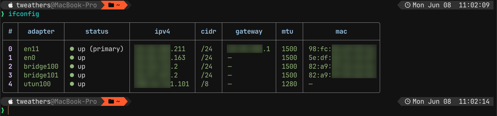
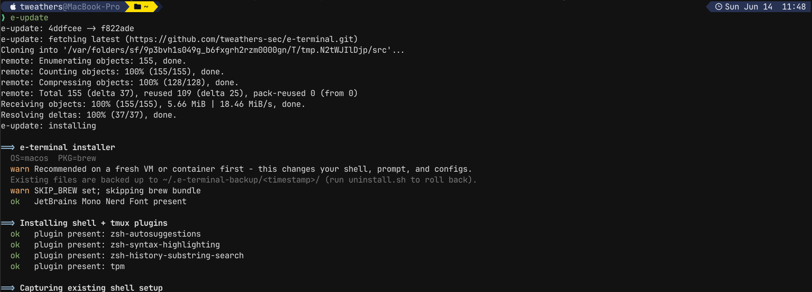
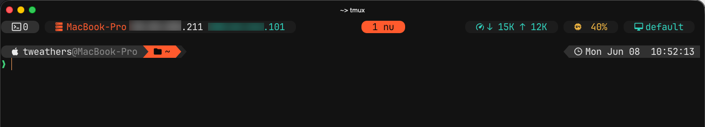
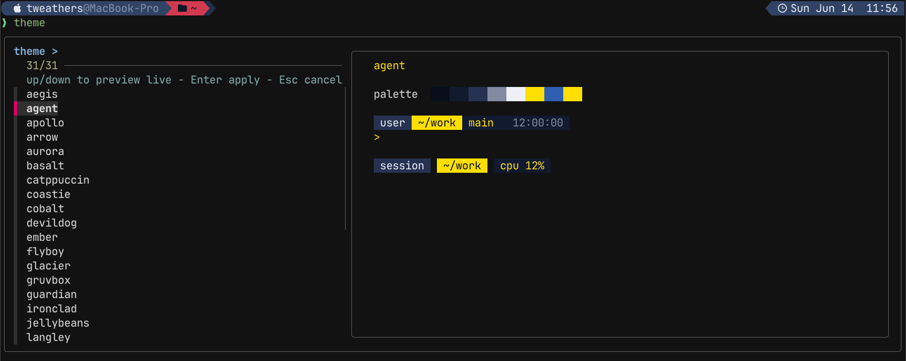
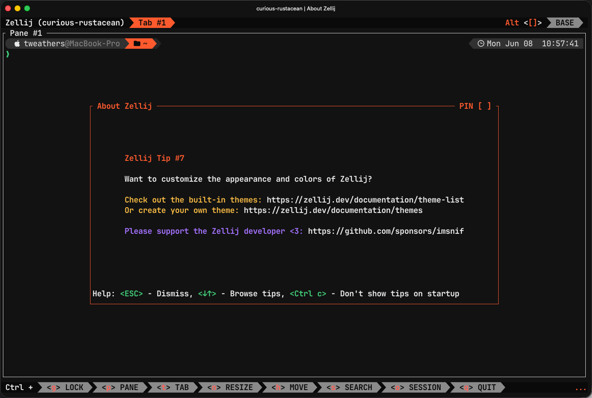
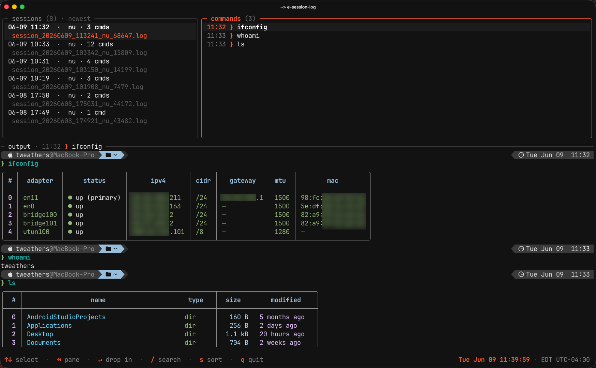
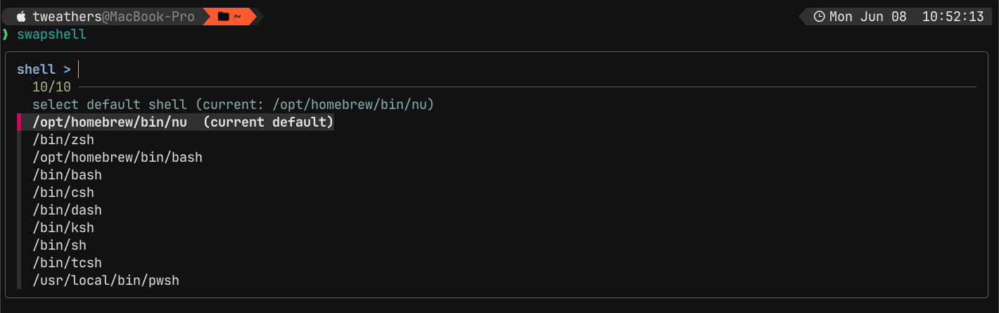

<div align="center">

# e-terminal

**One command. Any machine. The same beautiful, tactical terminal.**

Drop it on macOS, Debian, Ubuntu, Kali, or Parrot and get an identical, pilot-dashboard
terminal - themed prompt, status bar, multiplexer, and a cross-platform command toolbelt -
with zero manual tweaking.

```sh
git clone https://github.com/tweathers-sec/e-terminal.git ~/.e-terminal && ~/.e-terminal/install.sh
```



</div>

> **Warning - test on a disposable VM first.** The installer changes your shell, prompt, tmux, and
> terminal configuration and sets your **login shell**. Everything it replaces is backed up to
> `~/.e-terminal-backup/<timestamp>/` (and `uninstall.sh` restores it), but you should still validate
> it on a throwaway VM or container before installing on a machine you depend on.

---

## Highlights

- **Cross-platform, one command** - `./install.sh` bootstraps a bare box (packages, font, plugins,
  configs) on macOS *and* Debian/Ubuntu/Kali/Parrot. Idempotent and safe to re-run.
- **Switchable themes** - `theme` recolors the **prompt + tmux + zellij + command output** together, live. Ships
  `arrow` (default), `jellybeans`, `gruvbox`, `catppuccin`, `nord`, `tokyonight`.
- **Identical prompt in every shell** - a two-line Starship powerline that looks the same in
  Nushell and zsh.
- **A status bar that earns its space** - session, hostname + primary/tunnel IP, windows, network,
  CPU, and cloud context.
- **Structured command toolbelt** - `ifconfig`, `myip`, `ports`, `dns`, `scan`, `sslcheck`,
  `servers`/`sshm`, and more - all returning Nushell tables. Discover them with `ehelp`.
- **Session logging on by default** - every shell is recorded to `~/terminal_logs/` for later
  review and screenshots.
- **Styled root** - `sudo nu`, `sudo -i`, and `rootsh` get the same setup on macOS and Linux.

> The installer **never changes your login shell silently** and **never touches secrets.**

---

## Quick start

```sh
# 1. Clone + install (idempotent - safe to re-run)
git clone https://github.com/tweathers-sec/e-terminal.git ~/.e-terminal
~/.e-terminal/install.sh
```

The install strips git metadata from `~/.e-terminal`, so the deployed copy has no remote
and can't push back to the repo. To update later, run `e-update` - see [Updating](#updating).

Then:

1. Open a **new** terminal window.
2. In tmux, press `prefix + I` (`Ctrl-a`, then `Shift-i`) to install tmux plugins.
3. Run `swapshell` to choose your default shell.

**Requirements:** [Homebrew](https://brew.sh) on macOS; `sudo` on Linux (for `apt` + root setup).
[Ghostty](https://ghostty.org) is installed automatically on macOS and on headed (GUI) Linux;
headless servers skip it (the config is in place either way).

---

## Updating

The installer strips git metadata from `~/.e-terminal`, so a deployed copy has no remote of its own
and can't push back to the repo. To pull the latest onto any machine, run:

```sh
e-update
```



It clones the latest `main` to a temp directory, copies the updated **configs, themes, scripts,
plugins, and terminfo** into place, and on headed Linux keeps the **Ghostty app** current, then
cleans up. It skips the full package bundle and leaves your login shell alone (a new Ghostty release
on Linux may ask for sudo to install). Your **default shell** (`swapshell`) and **active `theme`** are
preserved across the update.

| Command | Does |
|---|---|
| `e-update` | Update only if a newer commit exists on `main` |
| `e-update --force` (`-f`) | Reinstall even if already up to date |
| `e-update --version` (`-V`) | Print the installed commit and exit |

Re-run the full `install.sh` instead when you need new system packages or want to redo the
login-shell / root setup. *(Repo overrides: `E_TERMINAL_REPO`, `E_TERMINAL_REPO_URL`.)*

---

## What it does

| Step | macOS | Debian / Ubuntu / Kali / Parrot |
|------|-------|---------------------------------|
| **Packages** | `brew bundle` (Brewfile) | `apt` + official installers/releases (starship, zoxide, eza, nushell, carapace, zellij; handles `batcat`/`fdfind` shims) |
| **Font** | `font-jetbrains-mono-nerd-font` cask | Nerd Fonts release → `~/.local/share/fonts` + `fc-cache` |
| **Ghostty** | Homebrew cask | headed (GUI) systems: latest `ghostty-ubuntu` .deb; headless: skipped |
| **Plugins** | TPM + zsh plugins (git clone) | same |
| **Configs** | copied into place (no symlinks); your originals saved once for rollback | same |
| **Root** | links the setup into `/var/root` | links the setup into `/root` |
| **Shell** | suggests `swapshell` (default: Nushell) | suggests `swapshell` (default: **zsh**) |

---

## The stack

| Tool | Role |
|---|---|
| **[Ghostty](https://ghostty.org)** | Terminal - JetBrains Mono Nerd Font, themed to match. Launches your login shell like every terminal (no `command` override). |
| **[Starship](https://starship.rs)** | Prompt - one two-line powerline, identical in Nushell and zsh. |
| **[tmux](https://github.com/tmux/tmux)** | Default multiplexer - `Ctrl-a` prefix, themed 3-zone status bar, sessionx/floax/resurrect/thumbs. |
| **[zellij](https://zellij.dev)** | Optional alternative multiplexer (alongside tmux) - themed to match. Launch with `zellij`. |
| **[Nushell](https://nushell.sh)** | Default shell on macOS - structured data, vi mode, carapace completions. |
| **zsh** | Default shell on Linux - autosuggestions, syntax highlighting, history-substring search. |
| **Toolbelt** | fzf · zoxide · eza · bat · fd · ripgrep · carapace |

The **prompt is identical in Nushell and zsh** by design, so switching shells never changes how
things look.

### The prompt

A two-line Starship powerline:

- **Line 1:** OS icon (auto-detected per distro) → `user@host` → directory → git status, with the
  time pushed to the right edge via `$fill` (so it works the same in every shell).
- **Line 2:** just the `❯` prompt character.


### The status bar (tmux)

Transparent background with rounded capsules, in three zones:

- **Left** - session name + **host capsule**: hostname, primary IP, and tunnel IP (NetBird /
  Tailscale CGNAT, auto-detected if present).
- **Center** - window list.
- **Right** - network throughput, CPU, and cloud context (Hetzner / DigitalOcean).



---

## Themes

Switch the **Starship prompt, tmux bar, zellij UI, and command output** (eza file/dir colors via
`EZA_COLORS`, derived from the theme palette) *together*, live - fonts and layout never change.

```sh
theme               # live preview; ↑/↓ to compare, Enter applies, Esc cancels
theme arrow         # apply by name (theme list shows them all)
theme list          # list available themes
```

| Theme | Look |
|---|---|
| **`arrow`** *(default)* | Tactical black + orange-red, matches the ARROW console |
| `jellybeans` | Muted neutral grays + soft sky-blue accent |
| `gruvbox` · `catppuccin` · `nord` · `tokyonight` | The popular dark palettes |
| `aegis` | royal blue on deep navy |
| `cobalt` | royal blue on black |
| `nightshade` | violet on navy |
| `meridian` | lime-chartreuse on near-black |
| `glacier` | cyan on navy |
| `nebula` | crimson + cyan on navy |
| `aurora` | neon teal + magenta on black |
| `basalt` | turquoise + orange-red on slate |
| `ember` | orange + blue on warm dark |
| `vermillion` | crimson on dark |
| `ironclad` | red-maroon on navy |
| `solstice` | orange on charcoal |
| `venom` | green on dark |
| `radon` | acid-yellow + blue on navy |

*In honor of those who have served, and those who continue to serve and keep us safe. These themes are for them.*

| Theme | Inspired by | Palette |
|---|---|---|
| `soldier` | U.S. Army | black + gold |
| `devildog` | U.S. Marine Corps | scarlet + gold |
| `sailor` | U.S. Navy | navy + gold |
| `flyboy` | U.S. Air Force | steel blue + bronze |
| `coastie` | U.S. Coast Guard | ocean blue + racing-stripe red |
| `guardian` | U.S. Space Force | silver + cosmic blue |
| `agent` | FBI | gold + blue + red |
| `apollo` | NASA | meatball red + blue |
| `langley` | CIA | teal-blue + gold |
| `sentinel` | DIA | indigo + crimson |
| `meade` | NSA | cyber-green + blue |



The same palette themes zellij too (an optional alternative multiplexer):



Switching is **live**: the prompt recolors on the next prompt; tmux and zellij hot-reload
immediately. Your choice **persists** (Starship `palette` + `~/.config/tmux/theme.conf` +
`zellij` `theme` line).

**Add your own:** drop a `<name>.conf` in `~/.config/tmux/themes/`, a matching `[palettes.<name>]`
block in `starship.toml`, and (optionally) a `<name>.kdl` in `~/.config/zellij/themes/`.

---

## Command toolbelt (`ehelp`)

Cross-platform structured commands (macOS + Linux), loaded by `config.nu`. **Run `ehelp`** to list
them all - `ehelp <text>` filters, and it returns a table, so `ehelp | where group == security`
works too.


| Command | What it does |
|---|---|
| `ifconfig` | Active host-adapter table: status (primary = default-route adapter), IPv4, CIDR, gateway, MTU, MAC. `--ipv6` adds v6; `-a` all adapters; `-r` raw. |
| `myip` | Public IP + provider + location (ipinfo.io), then internal addresses. `-l` = internal only, no network call. |
| `sysinfo` | Host dashboard: hostname/OS/kernel/uptime, load + cores, memory, disk, network, DNS. `--usb` lists USB devices. |
| `ports` | Listening sockets with owning **pid/process/user**. `-u` adds UDP; `--sudo` probes as root. |
| `dns <host>` | A/AAAA/MX/NS/TXT/CNAME records as a table; PTR for an IP. |
| `sslcheck <host> [port]` | TLS cert subject/issuer/SAN + **days-to-expiry** (green/amber/red). |
| `scan` | Hosts on the local network (ARP/neighbour cache: ip/mac/iface). |
| `geoip <ip>` | Geolocate any IP (org/city/region/country/coords). |
| `servers` · `sshm` | Unified Hetzner + DigitalOcean inventory; `sshm` fuzzy-picks one and SSHes in. |
| `genpass` · `b64` · `digest` · `urlencode`/`urldecode` | Password gen (`-s` symbols), base64 (`-d`), sha256/`--md5`/`--sha512`, percent-encoding. |
| `extract <archive>` | Unpack tar.\*/zip/gz/bz2/xz/zst/7z/rar by extension. |
| `weather [city]` · `psg <pat>` · `killp` | `wttr.in` one-liner; process search; fuzzy-pick-and-kill. |

Plus the helpers on `PATH`: **`swapshell`** (change default shell), **`theme`** (switch theme),
**`e-session-log`** (session logging), **`e-update`** (update to the latest from GitHub),
**`rootsh`** (styled root).

---

## Session logging

Every interactive terminal is **recorded by default** - review and screenshot sessions later. Each
shell is re-launched inside a small **resize-aware pty recorder** (falls back to `script(1)`),
capturing the full session (rendered prompt with its timestamp, every command, colors, output) to a
plain typescript. Resize-aware means the prompt keeps filling to the real window width even after
you resize - unlike bare `script(1)` on macOS. Logs land in:

```
~/terminal_logs/session_YYYYMMDD_HHMMSS_<shell>_<pid>.log
```

`cat` the file in any terminal to replay it with original colors. The recorder is re-entrant and
skips redundant work inside tmux panes.

```sh
e-session-log view        # browse past sessions in a 3-pane TUI
e-session-log status      # on? where? is this session recording?
e-session-log off | on    # disable / re-enable for future terminals
e-session-log dir         # print the log directory
```

### `e-session-log view` - browse your sessions

A fast terminal UI for reviewing recorded sessions. Pick a session on the left, step through the
commands it ran on the right, and read the fully rendered output below - colors, tables, and prompts
exactly as they appeared. Search across **all** logs by command, or by command + output (`⇥` toggles
the scope); sort by newest, oldest, or most commands (`s`); and press `↵` to drop into a full-screen,
scrollable replay of any session. Sessions are replayed at the exact size they were recorded, so wide
tables and long output render faithfully.



- **One session only:** launch it with `E_NO_SESSION_LOG=1`.
- **Change location:** export `E_SESSION_LOG_DIR=/path` (e.g. in `~/.zshrc.local` / `env.local.nu`).

---

## Shells & root

### `swapshell` - change your default shell

```sh
swapshell               # fzf-pick a shell, set it as the OS login shell, and start it now
swapshell zsh           # set the default directly (also: bash, nu, fish, or a full path)
swapshell --no-launch   # set the default only
swapshell --here        # start a shell for this session only (no default change)
swapshell --here zsh    # start zsh for this session only (no default change)
```

It sets the **OS login shell** with `chsh` (your own password - not sudo), so the change applies to
**every** terminal, then starts the new shell right away in a nested session.



### `rootsh` - styled root (macOS + Linux)

```sh
rootsh          # styled root nushell   (sudo -H nu under the hood)
rootsh zsh      # styled root zsh
```

The installer shares the setup with **root** on both OSes - linking configs into root's home
(`/var/root` on macOS, `/root` on Linux) and the user-installed tools onto a system `PATH` - so
`sudo nu`, `sudo -i`, and `rootsh` all get the same prompt and commands. `rootsh` is one
OS-detecting command. Skip with `SKIP_ROOT=1`; extend to every human user (Linux) with
`INSTALL_ALL_USERS=1`.

---

## Install options

Prefix the installer with any of these:

```sh
DRY_RUN=1 ./install.sh                      # print actions, change nothing
SKIP_FONT=1 ./install.sh                    # skip the font
SKIP_HCLOUD=1 SKIP_DOCTL=1 ./install.sh     # skip the cloud CLIs
```

| Flag | Effect |
|---|---|
| `DRY_RUN` | Print every action, change nothing |
| `SKIP_BREW` / `SKIP_APT` | Skip package installs |
| `SKIP_FONT` | Skip the Nerd Font |
| `SKIP_PLUGINS` / `SKIP_TMUX_PLUGINS` | Skip zsh / tmux plugins |
| `SKIP_CLEANUP` | Leave any pre-existing oh-my-zsh / prezto / zinit in place |
| `SKIP_SHELL_CHANGE` | Don't print shell-change advice |
| `SKIP_ROOT` | Don't configure root |
| `INSTALL_ALL_USERS` | Also link configs for every human user (Linux) |
| `NO_COLOR` | Plain output |

On install, conflicting zsh frameworks (oh-my-zsh, prezto, zinit, zplug, antigen, p10k) are **moved
into the backup dir** (`~/.e-terminal-backup/<timestamp>/`), never deleted - they fight the same ZLE
widgets as this setup. Restore them from there if needed.

---

## Secrets & machine-specific config

Nothing secret lives in this repo. The installer seeds two git-ignored override files, sourced last
- put machine PATHs, tokens, and env there:

- `~/.zshrc.local`
- nushell `env.local.nu` - in nu's native config dir: `~/Library/Application Support/nushell/` on
  macOS, `~/.config/nushell/` on Linux (run `nu -c '$nu.default-config-dir'` to confirm).

---

## Uninstall / rollback

```sh
~/.e-terminal/uninstall.sh        # remove installed files, restore your saved originals
```

Your pre-install originals are saved once to `~/.e-terminal-backup/original/` and restored on
uninstall. Packages are left installed (manual removal hints are printed).

---

## Repo layout

```
install.sh · uninstall.sh · Brewfile
lib/                common, symlink, packages, font, plugins, cleanup, root
config/
  ghostty/          config + themes
  starship/         starship.toml ([palettes.*] per theme)
  tmux/             tmux.conf, scripts/ (status), themes/ (per-theme @thm_*)
  zellij/           themes/ (per-theme KDL)
  nushell/          config.nu, env.nu, scripts/ (the toolbelt)
  zsh/              .zshrc
  bin/              swapshell · e-session-log · theme
```

Modeled on [omerxx/dotfiles](https://github.com/omerxx/dotfiles) and
[theRubberDuckiee/dev-environment-files](https://github.com/theRubberDuckiee/dev-environment-files).

---

## License

Copyright © 2026 Mayweather Group, VTEM Labs, and Travis Weathers. **All rights reserved.**

Source-available and **non-commercial**: free to use and modify for personal,
educational, and other non-commercial purposes. **Commercial / for-profit use
requires prior written permission** - contact [mwgroup.io/contact](https://mwgroup.io/contact/). See
[LICENSE](LICENSE) for full terms. Bundled third-party tools (Starship, tmux,
zellij, Nushell, eza, …) retain their own licenses.
